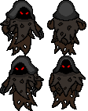

# Moonless Night

## Overview
Moonless Night is a online 2-player game.  Objectives are simple.  Survive through the night until the sun comes up by keeping the fire alive and preventing Ghosts from dwindling the fire.

### Win/Lose Condition
If the fire goes out then the game is over and the players lose.
If both players are too frightened to move, the game is over and the players lose.
If the players last the night then the players win.

### Brief Strategy
* Gather logs and sticks from surrounding trees and feed them to the campfire.
* Motivate the other player if they become too afraid to move.
* Keep away from Ghosts, unless you are carrying a torch.
* Grab torches from the campfire.

### Controls
`W` = move up  
`D` = move right  
`S` = move down  
`A` = move left  
`SpaceBar` = interact with other objects

## Demo
*in progress*

## MVP
* Grey Box
* Connecting Two Players
* Interactions between Classes
* Render sprites
* UI/UX
* Implementing game flow (waiting room, start of game, restarting of game)

## Implemented Technologies
* Express.js
* Node.js
* Websocket(socket.io)
* Canvas

## Group Members
* Julian
* Dylan
* Se Hwan
* Tyler

## Feature
* Only two players are allowed in the game. The server will terminate any subsequent players.
    ```javascript
    io.on("connection", socket => {
        // ... code omitted ...
        let clients = io.engine.clientsCount;

        if (clients > 2) {
            socket.disconnect(true);
        };
    ```


* Clients and the server communicate the game state by exchanging a `pack`
    ```javascript
    const pack = {
        player: Player.update(entities),
        tree: Tree.update(),
        fire: fire.update(),
        specter: Specter.update(),
        stalker: Stalker.update(),
        log: Log.update(),
        torch: Torch.update()
    };
    ```

* Map

    

* Specter

    

* Stalker

    

